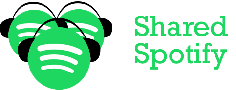

# Shared spotify

A cool way to find common songs among friends and create playlists out of those common songs.

Currently, **Spotify** and **Apple Music** are supported.

Website is available here at [sharedspotify.com](https://sharedspotify.com).

## Support

If you like what I am doing, feel free to support the project! Don't forget to tell me what feature you would 
love to add! 

## Product review

Screenshots and reviews are available on Product Hunt.

